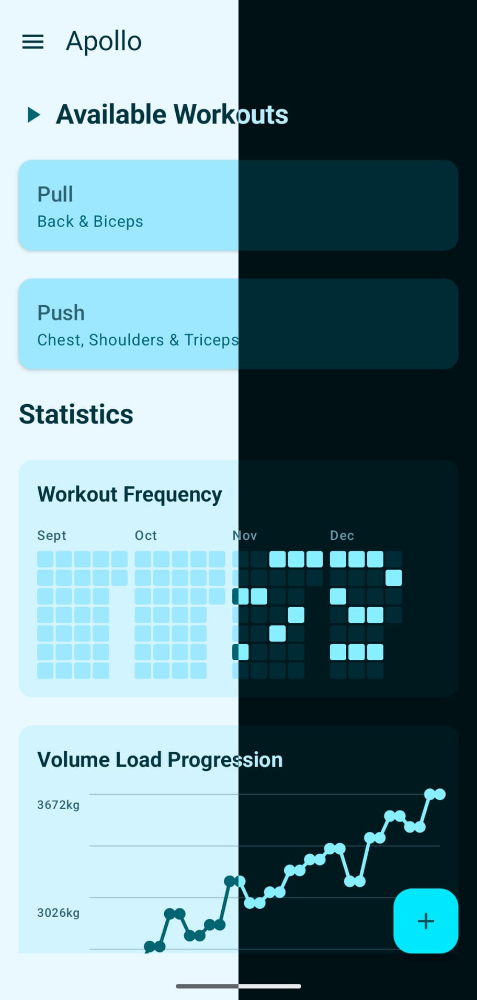
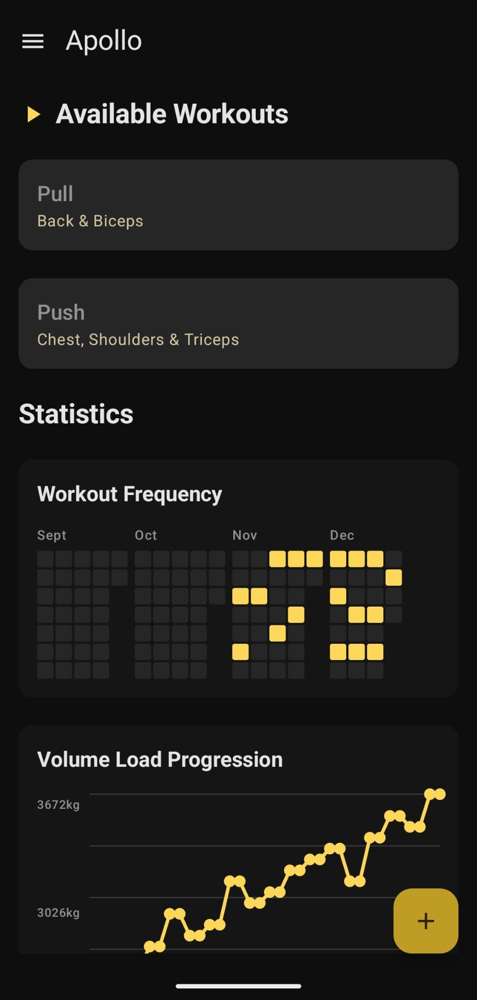

<div align="center">
  
  <h1>Apollo</h1>
</div>


Apollo is a modern Android application designed for me, a calisthenics enthusiast and developer.
Unlike generic fitness trackers, Apollo focuses on **progressive overload**, automatically adjusting
your goals based on your performance to ensure consistent strength gains, and allows you to import
workouts as JSON files.

Built with **Jetpack Compose** and **Clean Architecture**, it offers a buttery-smooth, offline-first
experience.


---

## Key Features

### Adaptive Goal Logic

Apollo doesn't just record your sets; it coaches you (kind of). The core engine (`GoalCalculator`)
uses a smart algorithm to determine your next target:

* **Maintenance**: If you miss a rep, the goal stays the same to ensure mastery.
* **Linear Progression**: Hit your target? +1 rep (or +5s for holds).
* **Explosive Progression**: Crushed it? Apollo detects "easy" sessions and bumps your goal
  aggressively to keep you challenged.

### Modern & Fluid UI

* **Material 3 Design**: Clean aesthetics with support for dark mode.

<div align="center">
    
    &nbsp;&nbsp;&nbsp;&nbsp;
    
</div>

* **High Refresh Rate**: Automatically requests 90Hz/120Hz for fluid scrolling and animations.
* **Interactive Graphs**: Visualize your progress with interactive charts that show your volume load
  and rep maxes over time.

### Offline First

Built on top of **Room Database**, Apollo stores all your data locally. No accounts, no servers, no
lag. Your workout history is always available, even in the middle of a forest park.

---

## Tech Stack & Architecture

This project follows **Modern Android Development (MAD)** practices:

- **Language**: [Kotlin](https://kotlinlang.org/) (100%)
- **UI Framework**: [Jetpack Compose](https://developer.android.com/jetpack/compose) (Declarative
  UI)
- **Architecture**: **MVVM** (Model-View-ViewModel) with **Clean Architecture** principles.
    - `data`: Room entities, DAOs, and Repositories.
    - `logic`: Pure Kotlin domain logic (e.g., `GoalCalculator`).
    - `ui`: Composable screens and ViewModels.
- **Local Storage**: [Room](https://developer.android.com/training/data-storage/room) with **KSP** (
  Kotlin Symbol Processing).
- **Concurrency**: Coroutines & helper Flows.
- **Navigation**: Jetpack Navigation Compose.

### Key Design Choices

* **Single Activity**: Uses a single `MainActivity` to host the navigation graph, reducing memory
  overhead and simplifying state management.
* **Domain-Driven Logic**: The progression algorithm is isolated in the `logic` package, making it
  easily unit-testable and independent of the Android framework.

---

## DevOps & CI/CD

This project uses **GitHub Actions** to ensure code quality and automate releases.

| Workflow                  | Description                                                             | Trigger                 |
|:--------------------------|:------------------------------------------------------------------------|:------------------------|
| **Build & Quality Check** | Runs Lint (`./gradlew lintDebug`) and Unit Tests (`testDebugUnitTest`). | Push to `master`        |
| **CodeQL Security Scan**  | Scans Kotlin/Java code for security vulnerabilities.                    | Weekly & on Push        |
| **Release**               | Automatically builds the APK and creates a GitHub Release.              | Tag push (e.g., `v1.0`) |

---

## Getting Started

### For Users

To install the app on your Android device:

1. Go to the [Releases Page](https://github.com/yourusername/MyCalisthenics/releases).
2. Download the latest apk.
3. Install it on your phone (you may need to enable "Install from unknown sources").

### For Developers

To contribute or explore the code:

1. **Clone the repository**:
   ```bash
   git clone https://github.com/yourusername/MyCalisthenics.git
   ```
2. **Open in Android Studio**:
   Ensure you are using the latest version (Ladybug or newer recommended).
3. **Sync Gradle**:
   Let Android Studio download the dependencies.
4. **Run**:
   Select an emulator or connect your physical device and press **Run**.
